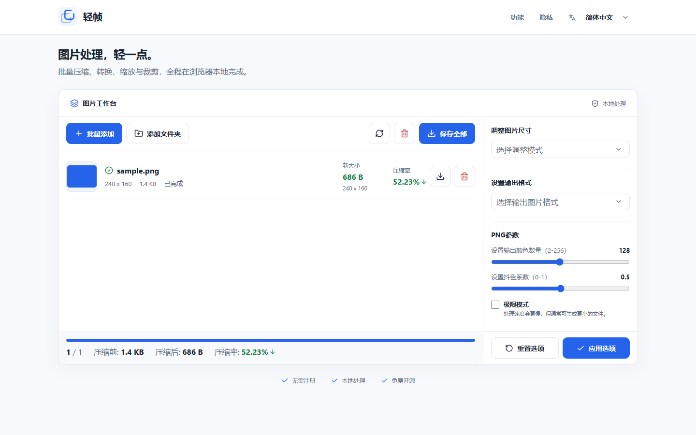

# LiteFrame (轻帧)

[English](../../README.md) · [简体中文](README.zh-CN.md) · [繁體中文](README.zh-TW.md) · [日本語](README.ja-JP.md) · [한국어](README.ko-KR.md) · [Français](README.fr-FR.md) · [Español](README.es-ES.md) · [فارسی](README.fa-IR.md) · [Türkçe](README.tr-TR.md)

LiteFrame, tamamen tarayıcıda çalışan ücretsiz ve açık kaynaklı bir toplu görüntü
sıkıştırıcıdır. Görüntüler Web Workers, WebAssembly, Canvas ve tarayıcı kodekleriyle
yerel olarak işlenir. Dosyalar hiçbir zaman bir uygulama sunucusuna yüklenmez.
[piczip.ajutx.com](https://piczip.ajutx.com/)

## Özellikler

- JPEG, PNG, WebP, GIF, SVG ve AVIF görüntülerini toplu olarak sıkıştırma.
- HEIC ve HEIF dosyalarını yerel olarak çözme ve JPEG, PNG, WebP veya AVIF olarak dışa aktarma.
- Format dönüştürme, yeniden boyutlandırma, kırpma ve kodlayıcıya özel kalite seçenekleri.
- Dosya seçici, klasör seçici, sürükle-bırak veya pano yapıştırma ile dosya ekleme.
- İnteraktif bölünmüş görünümle orijinal ve sıkıştırılmış görüntüleri karşılaştırma.
- Sonuçları tek tek indirme veya tüm partiyi ZIP arşivi olarak kaydetme.
- Gizliliğiniz korunur: tüm işlemler cihazınızda kalır.

## Ekran Görüntüsü



Temel çalışma alanı, toplu girdiyi, sıkıştırma sonuçlarını, çıktı ayarlarını ve
indirme eylemlerini tek bir görünümde birleştirir.

## Geliştirme

Gereksinimler:

- Node.js 22 LTS veya daha yenisi
- npm 10 veya daha yenisi

```bash
git clone https://github.com/joye61/pic-smaller.git
cd pic-smaller
npm ci
npm run dev
```

Faydalı komutlar:

```bash
npm test            # Test paketini çalıştır
npm run lint        # ESLint'i çalıştır
npm run build       # Bağımsız Node.js sunucusunu inşa et
npm run build:pages # Cloudflare Pages statik sitesini out/ dizinine dışa aktar
```

## Dağıtım

### Cloudflare Pages

Genel site, GitHub depo entegrasyonuyla Cloudflare Pages kullanır.
Cloudflare, siteyi aşağıdaki ayarlarla otomatik olarak inşa eder ve dağıtır:

| Ayar | Değer |
| --- | --- |
| Üretim dalı | `master` |
| Önizleme dalı | `develop` |
| İnşa komutu | `npm run build:pages` |
| Çıktı dizini | `out` |
| Node.js sürümü | `22` |

`master` dalına yapılan göndermeler üretimi günceller. `develop` dalına yapılan
göndermeler önizleme dağıtımları oluşturur. Diğer dallar otomatik olarak
dağıtılmaz.

Pages inşası, Next.js tarafından oluşturulan üst düzey `404.html` dosyasını kaldırarak
Cloudflare Pages'ın yerel tek sayfalı uygulama yedeğini uygulamasına olanak tanır.

### Docker

Docker imajı, özel veya kendi kendine barındırılan dağıtımlar için bir alternatiftir.
Next.js bağımsız çıktısını kullanır, ayrıcalıksız `node` kullanıcısı olarak çalışır,
sinyalleri `tini` aracılığıyla yönetir ve bir konteyner sağlık kontrolü içerir.

```bash
docker build --pull -t pic-smaller:latest .

docker run -d \
  --name pic-smaller \
  --restart unless-stopped \
  --read-only \
  --tmpfs /tmp:rw,noexec,nosuid,size=64m \
  --cap-drop ALL \
  --security-opt no-new-privileges \
  -p 127.0.0.1:3000:3000 \
  pic-smaller:latest
```

`http://127.0.0.1:3000` adresini açın. Genel erişim için konteyneri
Caddy, nginx veya Traefik gibi TLS sonlandırmalı bir ters proxy arkasına yerleştirin.
`127.0.0.1:` bağlama önekini yalnızca doğrudan ağa maruz bırakma kasıtlıysa kaldırın.

### Gizli Anahtarlar ve Yapılandırma

Bu web uygulaması API anahtarı gerektirmez. Kimlik bilgilerini,
Cloudflare token'larını, `.env` dosyalarını, `.dev.vars` dosyalarını, özel anahtarları
veya yerel Wrangler durumunu asla commit'lemeyin. Depo yoksayma kuralları bu dosyaları
hariç tutar. Gelecekteki bir özellik gizli anahtar gerektirirse, bunları dağıtım
platformunun gizli anahtar yöneticisinde saklayın ve `.env.example` dosyasında
yalnızca belgelenmiş yer tutucu adları sağlayın.

## Proje Yapısı

- `src/app/`: Next.js uygulama giriş noktaları.
- `src/components/`: yeniden kullanılabilir arayüz bileşenleri.
- `src/engines/`: tarayıcı kodekleri, worker'lar, dönüşümler ve sıkıştırma kuyruğu.
- `src/locales/`: çeviriler.
- `src/views/`: uygulama görünümleri.
- `public/`: inşa sırasında hazırlanan tarayıcı kodek ve WebAssembly varlıkları.
- `scripts/`: kodek hazırlığı ve dağıtım inşa yardımcıları.
- `tests/`: Node.js test paketi.

## Katkıda Bulunma

1. `develop` dalından bir dal oluşturun.
2. `npm test`, `npm run lint` ve ilgili üretim inşasını çalıştırın.
3. Davranış veya arayüz değiştiğinde belgeleri ve ekran görüntülerini güncelleyin.
4. Net bir açıklama ve doğrulama notlarıyla odaklanmış bir Pull Request gönderin.

## Lisans

LiteFrame, [MIT Lisansı](./LICENSE) altında sunulmaktadır.

## Teşekkürler

- [Squoosh Kit](https://github.com/bnowak008/squoosh-kit) — AVIF, ImageQuant ve OxiPNG kodekleri için.
- [heic-to](https://github.com/hoppergee/heic-to) — tarayıcı tarafında HEIC ve HEIF çözümleme için.
- [SVGO](https://github.com/svg/svgo) — SVG optimizasyonu için.
- [gifsicle-wasm-browser](https://github.com/renzhezhilu/gifsicle-wasm-browser) — GIF sıkıştırma için.

## Upstream attribution

LiteFrame is based on [Pic Smaller](https://github.com/joye61/pic-smaller).
The original MIT license and copyright notices are retained. Repository names,
deployment identifiers, and browser storage keys remain unchanged for compatibility.
